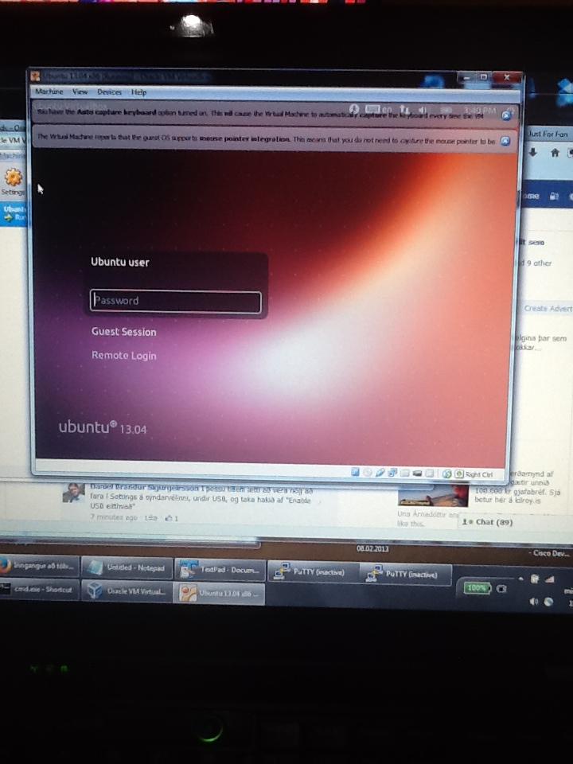

#Open Source

Hér á að koma listi af hópmeðlimum (sjá Markdown leiðbeiningar um það hvernig búa á til lista).

 - jonatantj12
 - ekki fleiri...

## 1. Linux uppsetning

This went... ok. Virtualbox kills my computer when I run it, not a big fan of that one, but as soon as I could install openssh-server and just ssh to the machine, it was usable.

The boot process was too quick to take a picture, but here's a picture of the login screen...

## 2. Uppsetning á vim && git

Gekk vel ad setja tolin upp... 

## 3. Unnið með Git (1. hluti)

Gekk vel ad forka verkefnid, er einn i hop, tannig ad tad reyndi ekki alveg a ad lata marga gera breytingar...

Herna [er forkid af NM](https://github.com/xnatti/INTOPrufa/)

###### Eg laerdi eflaust meira a tvi ad fa tessa mynd til ad virka...

## 4. Uppsettur hugbúnaður

* wireshark

	> SourceCode: http://anonsvn.wireshark.org/viewvc/releases/wireshark-1.8.9/

	> License: GNU GPLv2

* GIMP

	> SourceCode: ftp://ftp.gimp.org/pub/gimp/v2.8/

	> License:  (L)GPLv3+

* Code::Blocks

	> SourceCode: http://www.codeblocks.org/downloads/25

	> License: GPL v3.0

## 5. Unnið með Git (2. hluti)

Hér þarf ekkert að gera annað en að setja niðurstöður úr 4. fyrstu liðunum inn í þetta skjal.

OK, flott, komid. :)
